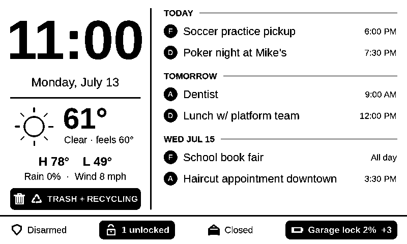

# board

Wall-mounted e-ink dashboard: ESP32 + Waveshare 7.5" e-Paper HAT (800×480,
monochrome), driven by ESPHome and fed from Home Assistant.



*(Pillow mockup with sample data — the real panel renders the same layout
from live HA state.)*

## Layout

- **Left column:** clock (minute resolution), date, current weather + today's
  high/low/rain/wind, and a trash/recycling badge (Mon noon → Tue noon;
  recycling parity anchored to 2026-07-14, computed on-device).
- **Right column:** merged agenda for the Drew/Ashley/Family/Birthdays
  calendars, grouped by day, with a D/A/F/B badge per event. The same event
  on two calendars collapses to one F row. Day headers for today +2 always
  render (an empty day means a free day), with work-status icons on the right
  end of the header rule: briefcase = office, laptop = WFH, airplane = work
  travel, palm tree = vacation, medical bag = sick. On-call shows a pager
  icon — inverted chip for primary, plain for secondary. Multi-day events
  show once under TODAY as "thru THU"; an event ending at or before 9am
  doesn't claim its final day.
- **Status bar:** alarm, lock rollup, garage doors, EV battery, indoor temp,
  plus a low-battery alert pill (worst offender by name, `+N` for the rest).
  Alert states render as inverted pills and are never dropped; normal items
  drop from the end of the priority list when space runs out.

`mockup/mockup.py` is the Pillow mockup used to iterate on the layout before
the ESPHome translation. It renders `mockup/out/mockup.png` (1-bit) and
`mockup_aa.png` (antialiased).

## Refresh strategy

Model `7.50inv2p` (partial-refresh variant; requires a V2 panel manufactured
after Sept 2023 — ours is). The display updates on the minute via
`time.on_time` (partial refresh, ~2s) with `full_update_every: 30`, so a
ghost-clearing full refresh happens every 30 minutes. If HA time has never
synced, a 60s `interval:` fallback repaints the "Connecting…" splash so the
panel can't silently show stale content.

## Home Assistant side (not in this repo)

ESPHome can't call HA services with responses, so calendar and forecast data
are staged into helpers by automations (all managed via the HA UI):

**Automations** (Settings → Automations, `eInk:` prefix):
- *update weather forecast* — hourly; `weather.get_forecasts` on
  `weather.openweathermap` → `input_number.eink_weather_{high,low,rain}`.
- *update calendar events* — every 15 min; `calendar.get_events` across the
  four calendars, merged/sorted/deduped → `input_text.eink_event_1..7` as
  `YYYY-MM-DD|label|badge|title` rows. Also reads `calendar.work_status`
  (all-day events titled Office/WFH/Travel/Vacation/Sick; priority
  Sick > Vacation > Travel > WFH > Office) and the PagerDuty-synced on-call
  calendar (a day counts as on-call if the shift overlaps 9am–9pm; "Primary"
  beats "Secondary") → `input_text.eink_day_status` as `YYYY-MM-DD|S|P` rows.
- *update battery rollup* — hourly + on threshold change; computes
  `input_text.eink_battery_worst` ("Garage lock 2%") and
  `input_number.eink_battery_low_count`.

**Tuning helpers** (adjustable live, no reflash; also on the eInk Board
dashboard):
- `input_number.eink_thresh_lock_batt` (default 20%) — lock/keypad batteries
- `input_number.eink_thresh_blind_batt` (default 10%) — blinds/curtains
- `input_number.eink_thresh_ev_batt` (default 20%) — EV pill becomes an alert below this
- `input_text.eink_status_priority` (default `alarm, locks, garage, ev, temp`)
  — status bar display order *and* drop order (dropped from the end; remove a
  token to hide the item)

**Dashboard:** "eInk Board" in the HA sidebar mirrors everything the panel
shows, including the full battery drill-down and the tuning sliders.

## Flashing

Copy `secrets.yaml.example` to `secrets.yaml` and fill in wifi credentials,
an API encryption key, and an OTA password. Then:

```bash
esphome run dashboard.yaml                          # OTA (device on wifi)
esphome run dashboard.yaml --device /dev/ttyUSB0    # first flash / rescue
```

USB flashing needs serial access (`uucp` group or `chmod a+rw /dev/ttyUSB0`).
The device is `eink-dashboard` on the LAN; mDNS may not resolve from the
desktop, so use the IP from the HA ESPHome integration if OTA can't find it.
